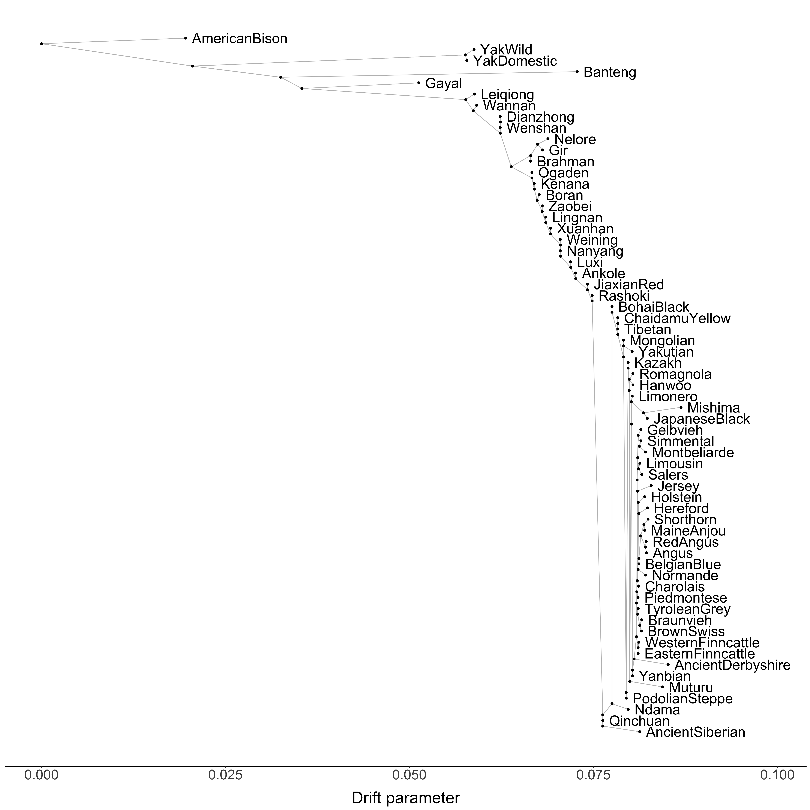

```{r setup, include=FALSE}
knitr::opts_chunk$set(echo = FALSE, message = FALSE, warning = FALSE)
library(readr)
library(dplyr)
library(stringr)
library(magrittr)
library(rlang)
library(purrr)
library(ggplot2)
library(tidylog)

source(here::here("source_functions/plotting_funcs.R"))
```

# Notes & questions

* ["Because we only use a single individual per taxon, we need to use the flag -noss. Otherwise, treemix will apply a correction for small sample size which is too conservative."](https://speciationgenomics.github.io/Treemix/)

# Setup

```{r}
sample_metadata <- 
  read_csv(here::here("data/derived_data/metadata/bovine_demo.sample_metadata.csv")) %>% 
  mutate(international_id = if_else(international_id == "CPC98_Bprimigenius_EnglandDerbyshire_5936", "ancient_derbyshire", international_id))
```

```{r, fig.width=8, fig.height=12}
save_treemix <- function(x, dataset, thin_p, fig_width = 10, fig_height = 12){
  png(here::here(glue::glue("figures/treemix/{dataset}.{thin_p}.{x}.png")), width = fig_width, height = fig_height, units = "in", res = 500)
  plot_tree(here::here(glue::glue("data/derived_data/treemix/output/{dataset}.{thin_p}/treemix.{dataset}.{thin_p}.{x}")))
  dev.off()
}

```

```{r}
save_treemix_resids <-
  function(x,
           dataset,
           thin_p,
           fig_width = 10,
           fig_height = 10) {
    png(
      here::here(
        glue::glue("figures/treemix/resids.{dataset}.{thin_p}.{x}.png")
      ),
      width = fig_width,
      height = fig_height,
      units = "in",
      res = 500
    )
    plot_resid(stem = here::here(
      glue::glue(
        "data/derived_data/treemix/output/{dataset}.{thin_p}/treemix.{dataset}.{thin_p}.{x}"
      )
    ),
    pop_order =  here::here(
      glue::glue(
        "data/derived_data/treemix/output/{dataset}.{thin_p}/poporder.{dataset}.{thin_p}.txt"
      )
    ))
    dev.off()
    
  }

```

# Modified full results {.tabset}

* Removed several individuals/populations
    + Recent American/Australian composite breeds (Santa Gertrudis, Beefmaster, and Droughtmaster)
    + "East African Zebu" with quality issues in fastSTRUCTURE and PCA
* Consolidated several populations 
    + All domestic yak breeds
    + All gayal populations
    + All Podolian Steppe breeds (Podolica, Maremmana, Boskarin, Sikias)
    + Combined Lowline Angus with Angus
    + Combined miniature Hereford with Hereford
* Removed all remaining populations with fewer than 5 individuals **excluding** Asian steppe breeds (Chaidamu Yellow) and the consolidated Podolian Steppe population 

The resulting dataset has 2,167 individuals:

```{r}
read_table2(here::here("data/derived_data/treemix/define_cluster.full.onepercent.txt"), col_names = c("id", "fid", "Population")) %>% 
  group_by(Population) %>% 
  tally(sort = TRUE)
```

```{r}
read_table2(
  here::here(
    "data/derived_data/treemix/define_cluster.full.onepercent.txt"
  ),
  col_names = c("international_id", "fid", "tmpop")
) %>%
  left_join(sample_metadata %>%
              select(international_id, species, continent, region, population)) %>%
  mutate(
    continent = str_to_title(continent),
    continent = forcats::fct_relevel(as.factor(continent),
                                     "europe",
                                     "africa",
                                     "asia",
                                     "americas"),
    region = case_when(
      region == "india and pakistan" ~ "India & Pakistan",
      region == "japan and korea" ~ "Japan & Korea",
      TRUE ~ str_to_title(region)
    ),
    region = forcats::fct_relevel(
      as.factor(region),
      "British Isles",
      "France",
      "Continental Europe",
      "Scandinavia",
      "Iberia",
      "Italy",
      "Podolian Steppe",
      "West Africa",
      "East Africa",
      "Middle East",
      "India & Pakistan",
      "Japan & Korea",
      "Southeast Asia",
      "Asian Steppe",
      "Northeast China",
      "East Central China",
      "South Central China",
      "Southeast China",
      "Americas"
    )
  ) %>% 
  arrange(region, tmpop) %>% 
  distinct(tmpop) %>% 
  write_tsv(here::here("data/derived_data/treemix/output/full.onepercent/poporder.full.onepercent.txt"), col_names = FALSE)
```

## Base tree

```{r, echo=FALSE,message=FALSE, warning=FALSE, eval=FALSE}
save_treemix(x = "base", dataset = "full", thin_p = "onepercent")
```



```{r, eval=FALSE}
save_treemix_resids(x = "base", dataset = "full", thin_p = "onepercent")
```


# Commentary
